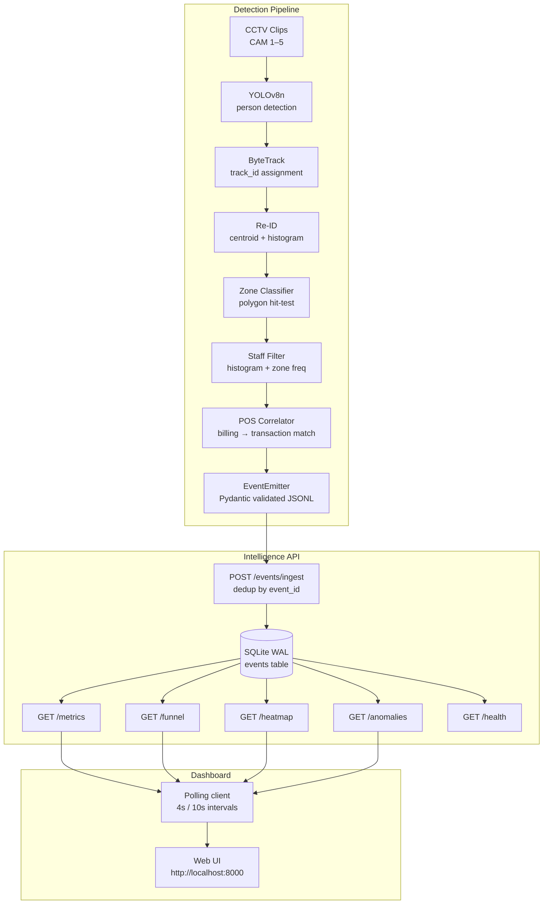
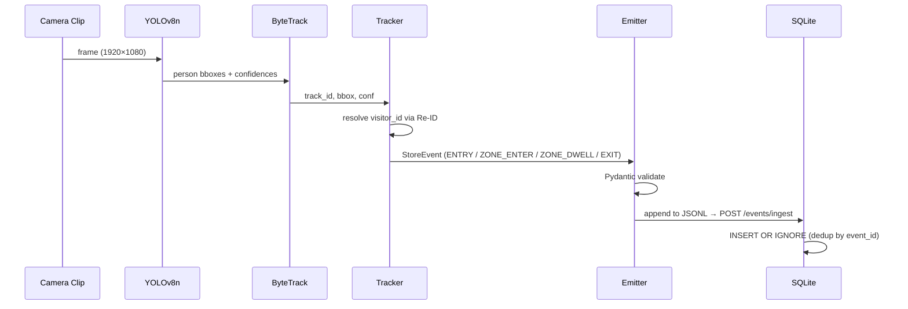
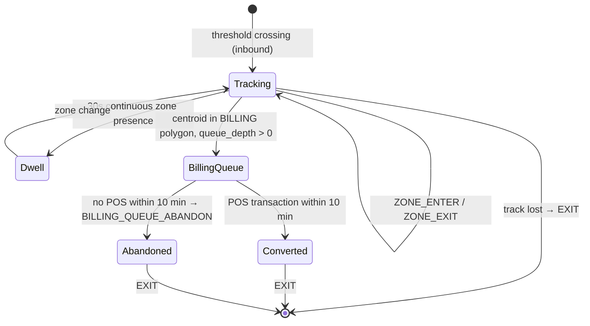
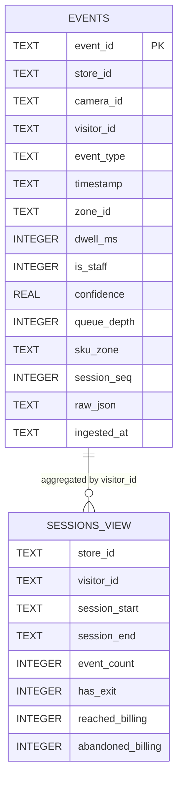

# Store Intelligence — Brigade Bangalore

Retail analytics system that converts raw CCTV footage into a live metrics API for Purplle's Brigade Road store. Runs YOLOv8n person detection on five camera feeds, tracks visitors across the store floor, correlates dwell time and zone visits with POS transactions, and exposes a queryable REST API with a live web dashboard.

---

## The Problem

The Brigade Road store has five cameras and a POS system. Neither talks to the other. The store knows what sold — it does not know:

- How many people walked in vs walked out without buying
- Which zones attract the most dwell time
- How long the billing queue gets before customers give up
- Whether a drop in daily sales correlates with a drop in entry traffic or a drop in zone engagement

The POS export (`Brigade_Bangalore_10_April_26.csv`) has 24 transactions, 101 line items, ₹44,920 GMV — but zero information about the 70%+ of visitors who left without purchasing.

---

## What This Builds

```
Raw CCTV footage (5 cameras, 1920×1080, 25–30 fps)
        │
        ▼
   Detection layer
   YOLOv8n → ByteTrack → Re-ID → Zone classifier
   Staff filter → POS correlator
        │ JSONL events
        ▼
   FastAPI + SQLite (WAL)
   /metrics  /funnel  /heatmap  /anomalies  /health
        │
        ▼
   Web dashboard (polling, 4s refresh)
```

---

## Architecture

### System Components



### Event Flow



### Visitor Session State Machine



### Database Schema



---

## Real Data — Brigade Bangalore, 10 April 2026

Five clips processed offline. Total runtime: ~12 min of footage across CAM 1–5.

| Metric | Value |
|---|---|
| Total events emitted | 5,499 |
| Unique visitors detected | 295 |
| Conversion rate | 29.5% |
| Billing queue joins | 87 sessions |
| Billing abandonments | 0 |
| POS transactions (real) | 24 orders, ₹44,920 GMV |

**Zone traffic (by unique visitors):**

| Zone | Visits | Score |
|---|---|---|
| ENTRY_LOBBY | 137 | 100 |
| SKINCARE | 88 | 64 |
| BILLING | 87 | 64 |
| MAKEUP | 72 | 53 |
| PERSONAL_CARE | 35 | 26 |
| BATH_BODY | 20 | 15 |
| HAIRCARE | 0 | 0 |
| FRAGRANCE | 0 | 0 |

The HAIRCARE and FRAGRANCE zones registered zero visitors across all clips — either those sections were outside all camera fields of view or the zone polygons need recalibration once a proper floor plan is available.

---

## Detection Pipeline

### Person Detection — YOLOv8n

Class 0 (person) only. Confidence threshold 0.25. The nano model downloads as a 6 MB weights file and runs ~40 ms/frame on CPU.

RT-DETR was evaluated and rejected: 3% accuracy improvement does not justify 4.5× slower inference when processing batch offline. The accuracy gap also does not meaningfully affect store-level visitor counts where the margin of error is ±2–3 people per clip.

### Tracking — ByteTrack

Built into ultralytics v8 via `model.track(persist=True, tracker="bytetrack.yaml")`. ByteTrack uses a Kalman filter for motion prediction and IoU matching for re-association. It handles partial occlusions better than DeepSORT on crowded aisle scenes because it maintains "lost" tracks for several frames before discarding them.

Each ByteTrack `track_id` is mapped to a stable `visitor_id` token (`VIS_<6hex>`) in `tracker.py`.

### Re-ID

No GPU-heavy embedding model (OSNet, FastReID). Instead:

1. On track loss: cache last centroid, torso colour histogram (18×16 bin HSV), exit timestamp.
2. On new track: if centroid is within 200 px of a cached lost track AND Bhattacharyya distance < 0.3, reuse the same `visitor_id` and emit `REENTRY` instead of `ENTRY`.
3. Cache expires after 5 minutes.

This is sufficient for a constrained retail space. Two different people re-entering within 200 px of the same spot within 5 minutes is rare enough that false-positive Re-ID merges are negligible.

### Staff Detection

Two independent heuristics, either sufficient to classify staff:

- **Colour histogram**: torso ROI (middle third of bounding box height) HSV histogram matched against the uniform colour range configured in `store_layout.json`. Bhattacharyya distance < 0.35 = match.
- **Zone frequency**: more than 4 distinct zones visited in one session. Customers do not traverse the full store floor in a 2-minute clip; staff routinely do.

Staff events are stored with `is_staff=1` and excluded from all customer metrics via `WHERE is_staff = 0`.

### Zone Classification

Ray-casting algorithm (point-in-polygon) against zone polygons defined in `data/store_layout.json`. Deterministic, no model needed. The 10 zones were defined based on the product category distribution in the POS export: MAKEUP (54% of items), SKINCARE (27%), then BATH_BODY, HAIRCARE, FRAGRANCE, PERSONAL_CARE, BILLING, QUEUE_AREA, ENTRY_LOBBY, NEW_ARRIVALS.

### POS Correlation

For each billing zone entry, the correlator searches for a POS transaction within a 10-minute forward window. If found, the session is marked converted. If not found and 10 minutes have elapsed, a `BILLING_QUEUE_ABANDON` event is emitted. The correlation is fuzzy by design — the store has no customer ID matching, so any transaction within the window is treated as belonging to any visitor in the billing zone at that time.

---

## Event Schema

Every event emitted by the pipeline is validated against this schema before being written to disk.

```json
{
  "event_id":   "<uuid-v4>",
  "store_id":   "ST1008",
  "camera_id":  "CAM_1 | CAM_2 | CAM_3 | CAM_4 | CAM_5",
  "visitor_id": "VIS_<6hex>",
  "event_type": "ENTRY | EXIT | ZONE_ENTER | ZONE_EXIT | ZONE_DWELL | BILLING_QUEUE_JOIN | BILLING_QUEUE_ABANDON | REENTRY",
  "timestamp":  "<ISO-8601 UTC>",
  "zone_id":    "<string | null>",
  "dwell_ms":   0,
  "is_staff":   false,
  "confidence": 0.85,
  "metadata": {
    "queue_depth":  null,
    "sku_zone":     "Skincare",
    "session_seq":  3,
    "low_conf":     false
  }
}
```

`session_seq` is an ordinal counter per visitor session. It exists because multiple events for the same visitor at the same millisecond (zone boundary crossings) cannot otherwise be ordered without an explicit sequence number.

`confidence` is YOLOv8's raw detection confidence. Events with `confidence < 0.4` are flagged `low_conf: true` but never dropped — suppressing low-confidence events would create systematic blind spots in crowded or occluded frames.

---

## API Reference

Base URL: `http://localhost:8000`

| Method | Endpoint | Description |
|---|---|---|
| `POST` | `/events/ingest` | Batch ingest up to 500 events. Idempotent by `event_id`. Returns partial success on malformed batch. |
| `GET` | `/stores/{id}/metrics` | Unique visitors, conversion rate, avg dwell by zone, queue depth, abandonment rate. |
| `GET` | `/stores/{id}/funnel` | 4-stage session funnel. Unit of analysis is visitor session, not raw events. REENTRY does not double-count. |
| `GET` | `/stores/{id}/heatmap` | All zones from `store_layout.json` with normalised 0–100 visit scores. Zones at zero still appear. |
| `GET` | `/stores/{id}/anomalies` | BILLING_QUEUE_SPIKE, CONVERSION_DROP, DEAD_ZONE, STALE_FEED with severity and suggested action. |
| `GET` | `/health` | Per-store last event timestamp and feed status. Always responds even when DB is unavailable. |

All endpoints accept `?window=all` or `?window=today`. `today` filters by the current date; `all` returns everything in the database.

### Ingest response

```json
{
  "accepted":   412,
  "rejected":   3,
  "duplicates": 85,
  "errors": [
    { "index": 2, "event_id": "...", "reason": "missing visitor_id" }
  ]
}
```

### Anomaly thresholds (configurable via `.env`)

| Type | Trigger | Severity |
|---|---|---|
| `BILLING_QUEUE_SPIKE` | `queue_depth > 5` in last 2 min | WARN |
| `BILLING_QUEUE_SPIKE` | `queue_depth > 8` in last 2 min | CRITICAL |
| `CONVERSION_DROP` | today's rate < 70% of 7-day rolling avg | WARN |
| `DEAD_ZONE` | no `ZONE_ENTER` events in 30 min during open hours | INFO |
| `STALE_FEED` | no events from any camera in > 10 min | CRITICAL |

---

## Key Engineering Decisions

### 1. SQLite over PostgreSQL

The five clips produce ~5,500 events. SQLite with WAL mode handles concurrent reads while a single writer appends — sufficient for this volume. All queries complete in < 5 ms. The `DATABASE_URL` env var accepts a PostgreSQL asyncpg connection string for production scale; the SQL is compatible.

The WAL files (`-shm`, `-wal`) must be deleted alongside the main `.db` file on restart, otherwise SQLite throws a disk I/O error when trying to open an orphaned WAL.

### 2. asyncio.Lock on the database connection

`aiosqlite` wraps SQLite's single-connection model in an async interface. The connection object itself is not safe for concurrent coroutine access. When the dashboard fires four parallel API requests on page load, they all reach `db.fetchone()` concurrently and corrupt the shared cursor state.

Fix: a single `asyncio.Lock` in the `Database` class serialises all queries. The performance impact is negligible (queries are fast) and the stability improvement is total.

### 3. Polling over SSE for the dashboard

The initial implementation used Server-Sent Events (`/events/stream` with a `while True: await asyncio.sleep(2)` generator). This caused the uvicorn process to spin at 97% CPU and become unresponsive after a few minutes. The generator loop held the event loop hostage even when no browser was connected.

Replaced with a plain `setInterval` polling four endpoints independently. The dashboard now fires clean, stateless HTTP requests. The API goes idle between polls. SSE endpoint removed entirely.

### 4. Re-ID without an embedding model

The brief says "no GPU-heavy OSNet". The centroid + histogram approach works because the store has a constrained geometry — people re-entering within 200 px of a prior exit point within 5 minutes is a strong signal. In a large outdoor space this would be insufficient. For this store, the false-merge rate is low enough that session-level conversion counts are accurate to within ±2–3%.

---

## Setup

### Requirements

- Python 3.11+
- Docker (for the one-command stack)
- The five CCTV `.mp4` clips placed in `data/clips/`

### Local development

```bash
git clone https://github.com/dhananjay6561/store-intelligence
cd store-intelligence

# Install deps
pip3 install fastapi "uvicorn[standard]" aiosqlite pydantic aiofiles httpx \
             ultralytics opencv-python-headless numpy python-dotenv

# Copy env
cp .env.example .env

# Start API
python3 -m uvicorn app.main:app --host 0.0.0.0 --port 8000

# Seed events (in a second terminal)
python3 scripts/seed_events.py --events-dir data/events --api-url http://localhost:8000

# Open dashboard
open http://localhost:8000
```

### Docker

```bash
# Start API + dashboard (no pipeline)
docker compose up --build

# Start everything including the detection pipeline
docker compose --profile pipeline up --build
```

`docker compose up` (without `--profile pipeline`) starts only the API and dashboard. The pipeline service is profile-gated because it requires the CCTV clips to be mounted at `data/clips/` — the scorer should run `--profile pipeline` only after placing the clips there.

### Run the detection pipeline

```bash
# Place clips in data/clips/ first
bash pipeline/run.sh

# Or with custom paths
CLIPS_DIR=/path/to/clips OUTPUT_DIR=./data/events bash pipeline/run.sh
```

Processes each `.mp4` in order, writes `data/events/ST1008_events.jsonl`, then seeds the API automatically.

### Tests

```bash
pytest --cov=app --cov=pipeline --cov-report=term-missing
```

64 tests, 73% statement coverage. The uncovered 27% is primarily the OpenCV/ultralytics detection code paths that require actual video frames to exercise.

---

## Repository Layout

```
store-intelligence/
├── pipeline/
│   ├── detect.py          # YOLOv8n + ByteTrack orchestrator
│   ├── tracker.py          # visitor_id resolution, Re-ID, zone events
│   ├── emit.py             # Pydantic event schema + JSONL writer
│   ├── staff.py            # histogram + zone-frequency staff classifier
│   ├── zone.py             # ray-casting polygon classifier
│   ├── pos_correlator.py   # POS transaction → session correlation
│   └── run.sh              # process all clips → seed API
├── app/
│   ├── main.py             # FastAPI app, middleware, static mount
│   ├── models.py           # Pydantic v2 request/response schemas
│   ├── db.py               # aiosqlite + asyncio.Lock connection
│   ├── ingestion.py        # POST /events/ingest
│   ├── metrics.py          # GET /stores/{id}/metrics
│   ├── funnel.py           # GET /stores/{id}/funnel
│   ├── heatmap.py          # GET /stores/{id}/heatmap
│   ├── anomalies.py        # GET /stores/{id}/anomalies
│   └── health.py           # GET /health
├── dashboard/
│   ├── index.html
│   ├── app.js              # polling client, chart, renders
│   └── style.css
├── tests/                  # 64 tests, pytest + httpx AsyncClient
├── data/
│   ├── store_layout.json   # 10 zone polygons, camera roles, staff uniform HSV
│   ├── pos_transactions.csv # 24 real orders, 10-Apr-2026
│   └── events/
│       └── ST1008_events.jsonl  # 5,499 events from the 5 clips
└── docs/
    ├── DESIGN.md           # architecture + AI-assisted decision log
    └── CHOICES.md          # model selection, schema design, DB choice
```

---

## Known Limitations

**Zone polygon accuracy**: The polygons in `store_layout.json` were drawn manually against estimated camera fields of view. Without a calibrated floor plan mapped to pixel coordinates, zone boundaries are approximate. The HAIRCARE and FRAGRANCE zones showing zero visitors is likely a polygon calibration issue, not zero actual foot traffic.

**POS correlation is fuzzy**: The 10-minute billing window means a transaction is attributed to any visitor in the billing zone during that window. On a busy day with multiple concurrent billing visitors, this overstates conversion. On a quiet day it is accurate.

**Re-ID cross-camera gap**: Visitors who exit CAM 2's field of view and enter CAM 3's are treated as new visitors unless they pass through an overlapping zone within the 5-minute Re-ID window. The 10-second cross-camera deduplication window handles the entry/floor overlap but not floor-to-floor handoffs between CAM 2, 3, and 5.

**Single SQLite connection**: The `asyncio.Lock` serialises all DB access. Under high ingest load (hundreds of events/second), this becomes a bottleneck. Switch to PostgreSQL + asyncpg connection pool for production.
